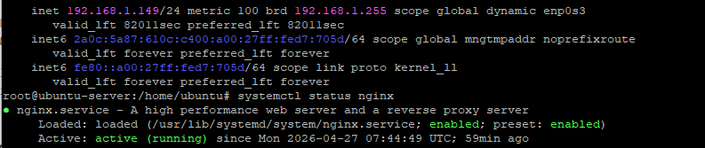
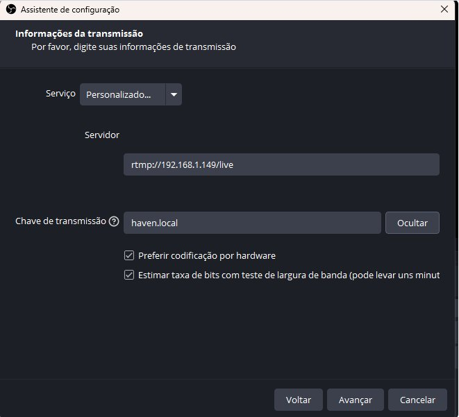
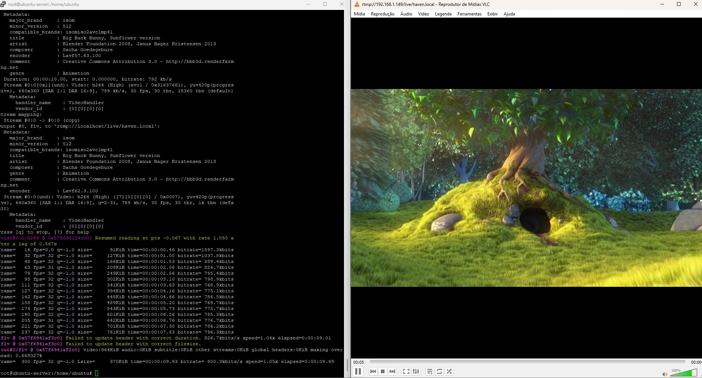
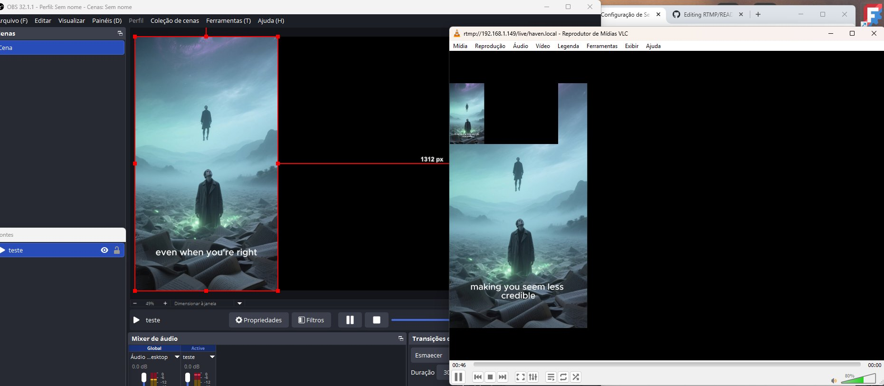

[README.md](https://github.com/user-attachments/files/27117881/README.md)
#  Servidor de Video Streaming con NGINX-RTMP y FFmpeg

<div align="center">


**Infraestructura completa de streaming en tiempo real: desde la ingesta con OBS Studio hasta la reproducción en VLC, pasando por un servidor NGINX-RTMP sobre Ubuntu Server.**

</div>


##  Índice

- Descripción del Proyecto
- Arquitectura del Sistema
- Fundamentos Técnicos
- Configuración del Servidor
- Configuración de OBS Studio
- Validación con FFmpeg
- Resultados Finales
- Tecnologías Utilizadas


##  Descripción del Proyecto

Este proyecto documenta la **configuración y despliegue de una infraestructura de streaming de vídeo** utilizando el protocolo **RTMP** (*Real-Time Messaging Protocol*). La solución permite la ingesta de flujos multimedia desde un codificador profesional (**OBS Studio**) y su posterior distribución a clientes de red de forma eficiente y estable.

El objetivo es demostrar la implementación completa de un pipeline de streaming extremo a extremo, desde el origen hasta el cliente final, sin depender de servicios externos de terceros.


##  Arquitectura del Sistema

La práctica utiliza una **arquitectura híbrida** que combina virtualización y sistema nativo:

| Componente | Tecnología | Detalle |
|---|---|---|
|  **Servidor** | Ubuntu Server 24.04 LTS | Máquina virtual en VirtualBox |
|  **Servicio de Streaming** | NGINX + `libnginx-mod-rtmp` | Motor principal de distribución |
|  **Codificador de Ingesta** | OBS Studio | Sistema anfitrión Windows |
|  **Procesamiento de Medios** | FFmpeg | Transcodificación y pruebas locales |
|  **Reproductor de Red** | VLC Media Player | Validación del flujo final |

```
┌─────────────────────┐        RTMP :1935         ┌──────────────────────┐
│   OBS Studio        │ ───────────────────────▶ │  Ubuntu Server VM     │  
│   (Windows Host)    │                           │  NGINX-RTMP          │
│   H.264 / AAC       │                           │  192.168.1.149       │
└─────────────────────┘                           └──────────┬───────────┘
                                                             │
                                                    rtmp://192.168.1.149
                                                      /live/haven.local
                                                             │
                                                  ┌──────────▼───────────┐
                                                  │   VLC Media Player   │
                                                  │   (Cliente de Red)   │
                                                  └──────────────────────┘
```


##  Fundamentos Técnicos del Protocolo RTMP

El protocolo **RTMP** opera sobre la capa de transporte **TCP**, garantizando una transmisión de datos fiable para aplicaciones en tiempo real mediante una **conexión persistente** entre el cliente y el servidor.

| Parámetro | Valor | Justificación |
|---|---|---|
| **Protocolo de transporte** | TCP | Fiabilidad en tiempo real |
| **Puerto de escucha** | `1935` | Puerto estándar RTMP |
| **Tamaño de chunk** | `4096 bytes` | Equilibrio entre eficiencia y latencia |
| **Códec de vídeo** | H.264 (AVC) | Compatibilidad global estándar |
| **Códec de audio** | AAC | Calidad y eficiencia de compresión |
| **Frecuencia de audio** | 44.1 kHz | Calidad de audio estándar |

> **¿Por qué RTMP?** Es el estándar de la industria para el envío de flujos desde el origen (*publisher*) hacia el servidor. El flujo se fragmenta en paquetes denominados *chunks*, lo que permite un control preciso de la latencia.


##  Configuración del Servidor Paso a Paso

### A. Preparación del Hostname e Instalación

Definición de la identidad de la máquina en la red e instalación de las herramientas necesarias:

```bash
sudo hostnamectl set-hostname haven.local
sudo apt update && sudo apt install libnginx-mod-rtmp ffmpeg -y
```

### B. Configuración del Motor NGINX-RTMP

Edición del archivo de configuración principal `/etc/nginx/nginx.conf` para habilitar la escucha de vídeo en el **puerto 1935**:

```nginx
rtmp {
    server {
        listen 1935;
        chunk_size 4096;

        application live {
            live on;
            record off;
        }
    }
}
```

### C. Activación de Servicios y Reglas de Firewall

```bash
# Abrir el puerto RTMP en el firewall
sudo ufw allow 1935/tcp

# Reiniciar NGINX para aplicar la configuración
sudo systemctl restart nginx

# Verificar el estado del servicio
sudo systemctl status nginx
```

###  Captura 01 — Estado del servidor e IP asignada

> *Terminal mostrando la IP del servidor `192.168.1.149` y el servicio NGINX activo.*




##  Configuración del Codificador OBS Studio

Parámetros técnicos configurados en OBS Studio para la transmisión hacia la máquina virtual:

| Parámetro | Valor |
|---|---|
| **Tipo de emisión** | Servidor de retransmisión personalizado |
| **URL del servidor** | `rtmp://192.168.1.149/live` |
| **Clave de retransmisión** | `haven.local` |
| **Códec de vídeo** | H.264 |
| **Bitrate de vídeo** | 6000 kbps |
| **Códec de audio** | AAC |
| **Frecuencia de audio** | 44.1 kHz |

###  Captura 02 — Ajustes de emisión en OBS Studio

> *Ventana de configuración de OBS con la URL del servidor y la clave de transmisión `haven.local`.*




##  Validación Técnica con FFmpeg

Verificación de la capacidad del servidor para procesar archivos locales mediante **FFmpeg**, usando el vídeo de prueba *Big Buck Bunny*:

```bash
# Descarga del archivo de prueba
wget https://test-videos.co.uk/vids/bigbuckbunny/mp4/h264/360/Big_Buck_Bunny_360_10s_1MB.mp4 -O video.mp4

# Ingesta del flujo hacia el servidor NGINX-RTMP
ffmpeg -re -i video.mp4 \
       -c:v copy \
       -c:a aac \
       -ar 44100 \
       -ac 1 \
       -f flv \
       rtmp://localhost/live/haven.local
```

> ** Parámetro clave**: El flag `-re` es fundamental, ya que indica a FFmpeg que lea el archivo a **velocidad de reproducción real**, simulando fielmente un flujo de transmisión en vivo. Sin este parámetro, el archivo se enviaría a máxima velocidad, rompiendo la ilusión del streaming.

###  Captura 03 — FFmpeg procesando y VLC reproduciendo

> *Terminal con FFmpeg transmitiendo el vídeo y VLC reproduciéndolo en tiempo real mediante la URL de red.*



---

##  Resultados y Reproducción Final

La validación final se realizó conectando **VLC Media Player** al flujo generado por el servidor. La URL de red utilizada fue:

```
rtmp://192.168.1.149/live/haven.local
```

Se confirmó la **recepción sincronizada de audio y vídeo** procesado por el servidor NGINX, demostrando que la infraestructura es capaz de recibir, gestionar y distribuir contenido multimedia con **latencia mínima**.

###  Captura 04 — OBS y VLC en funcionamiento simultáneo

> *Vista final: OBS Studio transmitiendo en directo y VLC reproduciéndolo simultáneamente a través del servidor NGINX-RTMP.*




##  Tecnologías Utilizadas

<div align="center">

| Tecnología | Versión | Rol |
|---|---|---|
|  | 24.04 LTS | Sistema Operativo del Servidor |
|  | + mod-rtmp | Motor de Streaming |
|  | Lavf62.3 | Procesamiento de Medios |
|  | 32.1.1 | Codificador de Ingesta |
|  | Latest | Reproductor / Cliente |
|  | — | Virtualización |

